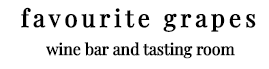
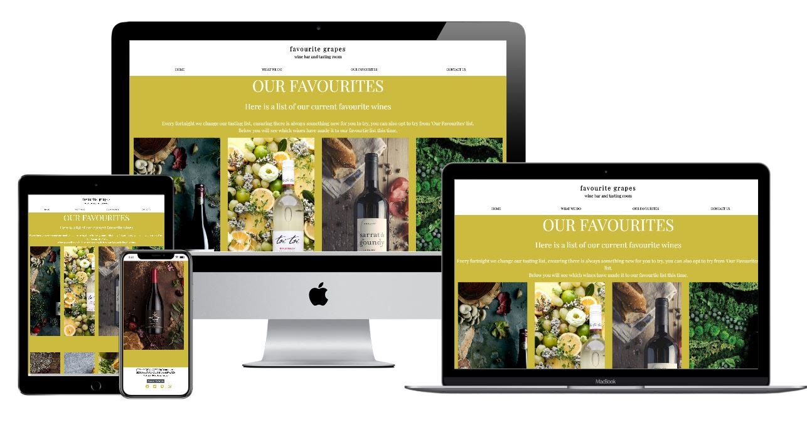
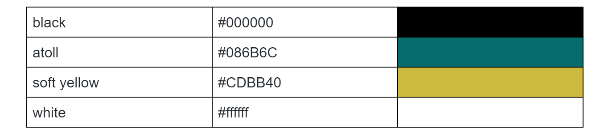

# Favourite Grapes - https://lucyrush.github.io/milestone1/
Favourite Grapes is one of Dublin’s first wine bars and tasting rooms. It is a standing room dedicated to inspiring and educating people on delicious wines.
Ireland is currently undergoing a culinary revolution, with a growing cosmopolitan population and it’s increasing emphasis on quality over quantity. Dublin, Ireland’s capital, is the perfect place for the wine bar. 
The aim of this site is to introduce users to the new wine bar and show users the beauty of sustainable, ethically sourced, artisan wines and the pure joy of discovering ‘that-wine’ that pairs well with everything. 

## UX

### User Stories

#### As a user, I want to:

- Find out the basic information about the wine bar, including their open days and opening hours.
- Get an idea on what is done at the bar, and to see if I need to make a reservation or to arrive if I can just arrive to plan my visit. 
- View a list of available wines to choose from, perhaps learn more about each wine by following the link to wine-makers. 
- Confirm that I need to make a booking for the tasting, and to get in touch with the bar to make the reservation.
- Find a link to the bar’s social media sites to stay informed on events and special. 
- Get an idea on what music to expect at the bar by following their link to their Spotify playlist. 

#### As a site owner, I want to:

- Make known the reasons to visit Favourite Grapes to generate revenue
- Give the user a good idea on when the bar is open
- Explain what we do at the bar, making it known that the user needs to book a wine tasting and that walk-ins are also on option to plan their visit
- Share the list of our favourite wines that are available to taste and purchase at the bar-
Make it easy for the user to contact us should they wish to book a tasting
- Share our ongoing wine enthusiasm with links to all relevant social media sites
- Include a link to the Spotify playlist mentioned to give the user a good idea of what music they can expect. 

### Target Audience

The marketing for Favourite Grapes would be targeted and men and women who are looking to learn more about wines while enjoying a wine of their choice. The audience will be aged between 21-55, earning well and likely regular restaurant patrons. The patrons would typically be social, stylish and interested in the night-life of a capital city. 

## Strategy

My goal of this site is to create a simple, visually appealing website to help new and experienced wine lovers discover sustainable and ethically sourced wine from all over the world in one location with a four-page static site. 

## Scope

To provide potential customers with information on the wine bar, a description on what is done, including tastings and buying wine per glass, a list of the available wines to taste and the best way to contact the wine bar.

## Structure

The main structure of this website involves 4 pages, the landing page, the What We Do page, the Our Favourites page and the Contact Us page. 

The navbar is not fixed to the top and appears first for all four pages. The Logo (Favourite Grapes) and the slogan (wine bar and tasting room) is also a link to the Home page. On smaller screens, the navbar collapses using Bootstrap, to a horizontally stacked menu, keeping the same font and background colour as on larger screens.

The pages will all include the same heading and footer. Each of the pages have large text, reminding the user which page they are on. The large text is the same as the Nav bar text items. The second heading is slightly smaller than the main page heading. This line gives the user a little more information on what they can expect from the page that they have visited. The smaller text is information on the bar which either gives the user a better understanding of the bar, the current list of wines or how to contact the bar. 

The footer of each page is the same. The footer includes the opening hours and days. The footer also links the different social medias, making it easy for the user to stay informed about all news and events the bar publishes. The ‘Make A Reservation’ button will direct the user to the ‘Contact Us’ page, which speeds up the reservation process for the user. 

## Skeleton

This website is static and is composed of four pages.

Each of the pages are simply styled with images taking up most of the real estate on the pages. The heading and the footer are the same throughout the pages of the site. 

These are the wireframes, which include both the desktop and mobile view for each section:

  1. [Home Page](https://github.com/lucyrush/milestone1/blob/master/wireframes/Home%20Page.png)
  2. [What We Do Page](https://github.com/lucyrush/milestone1/blob/master/wireframes/What%20We%20Do%20page%20.png)
  3. [Our Favourites Page](https://github.com/lucyrush/milestone1/blob/master/wireframes/Our%20Fvourites%20Page.png)
  4. [Contact Us Page](https://github.com/lucyrush/milestone1/blob/master/wireframes/Contact%20Us%20.png)
  
These pages are not very detailed but give a rough overview of the layout used to create the pages. There is definitely room for improvement. 
  
## Surface

The colour scheme for this project was quite minimalistic, involving mostly a mustard yellow, white and black. I thought it would be best to keep the colour scheme simple because the images used in the site, especially the ‘Our Favourites’, are colourful already. 

The colours used were:

The site makes use of one key font :

- Playfair Display

## Features

### Existing Features

#### Heading

- The heading is identical across all pages to maintain easily identifiable links and navigation throughout the site. 
- The heading consists of a center-aligned logo and slogan. The logo (favourite grapes) is text, the letters are spaced apart and the text is in lower case. The slogan is smaller than the logo and does not have spacing between the letters.
- The menu/navigation bar is horizontally aligned and over the entire width of the page on large and medium screens. The navigation is stacked vertically on small screens. 

#### Home Page

- This is the landing page when users arrive when they follow the link. The user sees an attractive, almost enticing picture of a woman drinking a rich red wine. Users are presented with a nav bar, a large Welcome heading, a brief description about the bar as well as a short summary on what can be done at the bar. 
- The page is simple and was split into two sections in large and medium screens. On smaller screens the page stacks horizontally, with the text before the image.

#### What We Do Page

- This page gives the user a description of what is done in the bar. It allows the user to get an idea of what type of wines are served at the bar. 
- The page is split into two evenly sized sections on large screens. On smaller screens the image will be displayed first. Users can scroll down to see the text. 

#### Our Favourites Page 

- This page definitely has the most content for the user to read. It is designed for site owners to regularly make changes to images and wine listings. It allows the user to see which wines will be available to taste and purchase at the bar. 
- When the user scrolls over the images, an interesting hover effect will be displayed. The user will see the vintage and name of wine, then underneath the name there will be the name of the wine farm the wine originated from. The name of each of the wine farms are links to their respective sites. This will allow the user to visit the sites should they wish to purchase wine from the source. I feel this is inline with international and cosmopolitan atmospheres created by the wine tastings. Users will be able to get a sense that the wine procured for the bar is of fine quality and thoughtfully sourced. 

#### Contact Us

- The contact us page is important because it is where the user is directed to make a reservation for a wine tasting. 
- The heading of the form on the page prompts the user to get in touch to make a reservation. The form’s background image is on wine being poured, this looks light and appealing to the user. 

#### Footer

- The footer is identical throughout the site. 
- The footer includes details on when the bar is open, which days the bar is open and that the user will need to get in touch to reserve a wine tasting. 
- The button is a link to the ‘Contact Us’ page which allows the user to easily navigate themselves to where they need to get in touch. 
The footer also includes links to the bars social media, as well as a link to the bars Spotify. The playlist was mentioned in the ‘What We Do’ page. 

### Features Left To Implement

- Wishlist page where users can add wines they would like to taste at the bar. This could be included in the ‘Our Favourites’ page. 
- Upload section where users can upload images and reviews of their wine tasting experiences. 
- Online store page for users to buy wines directly from Favourite Grapes after tasting them in the bar. 
- Overall, I would recommend revising the spacing and padding of the site's text. The text could be better centered and spread on larger screens to improve readability for the user. 

## Technologies Used 

- HTML
- CSS
- Boostrap

### Also made use of:

- [Font Awesome](https://fontawesome.com/)
- [Google Fonts](https://fonts.google.com/)
- [HTML Validator](https://www.freeformatter.com/html-validator.html)
- [CSS Validator](https://validator.w3.org/)
- Testing with Chrome DevTools
- Learned from [W3Schools](https://www.w3schools.com/) and  [Bootstrap 4 Tutorial](https://www.youtube.com/watch?v=qmPmwdshCMw&t=21s)
